#  The Golden Shell
My submission for Juniper Dev's **The Very Serious Game Jam**.
### Cover

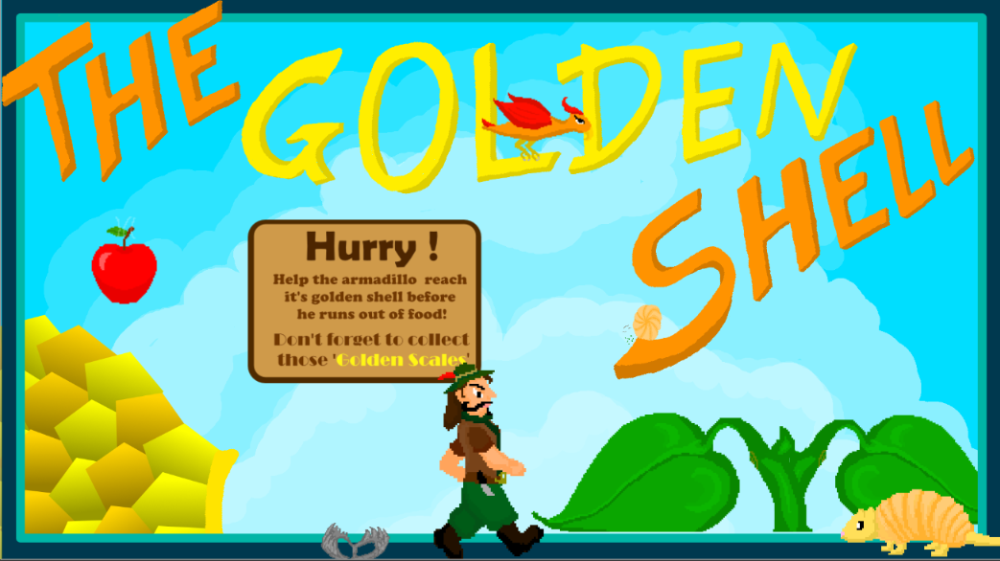

## About The Game
The Golden Shell is a 2D side-view game where the player controls an armadillo on a journey to reach the legendary Golden Shell while avoiding various obstacles.
The project was created during a game jam with a limited development time.

## Screenshots

### Gameplay

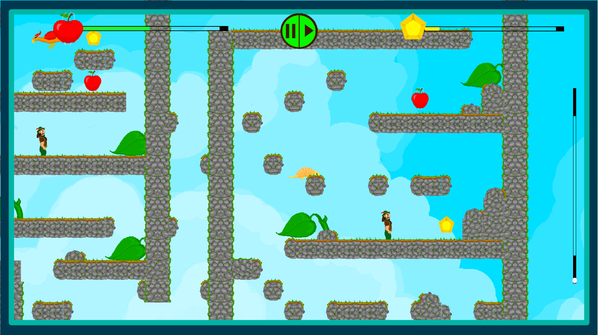

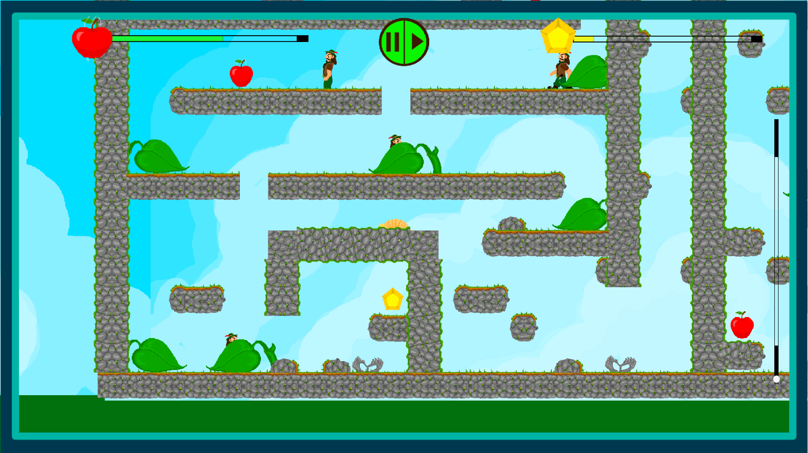

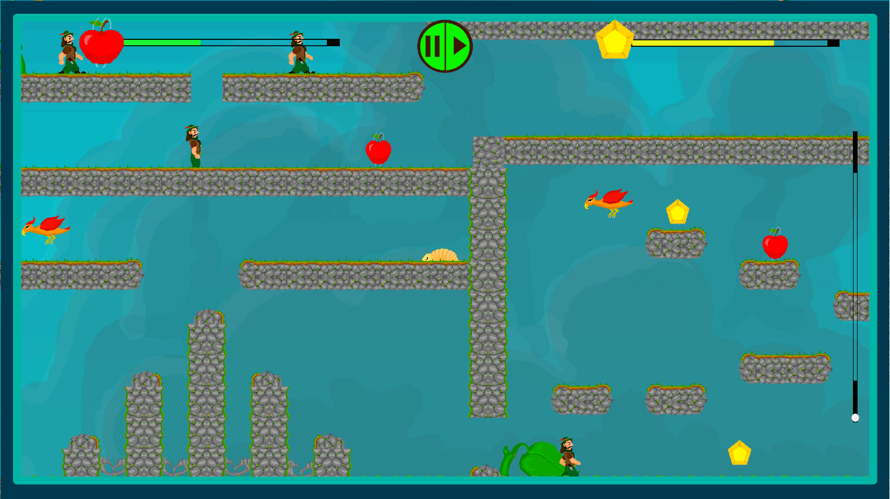

### Development

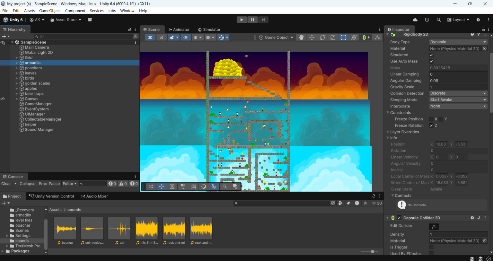
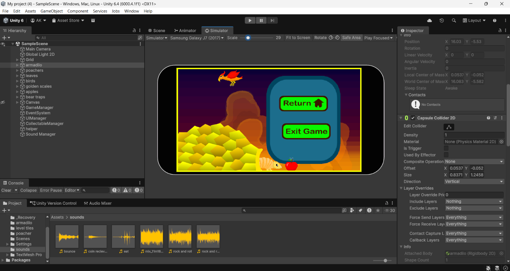

### Art

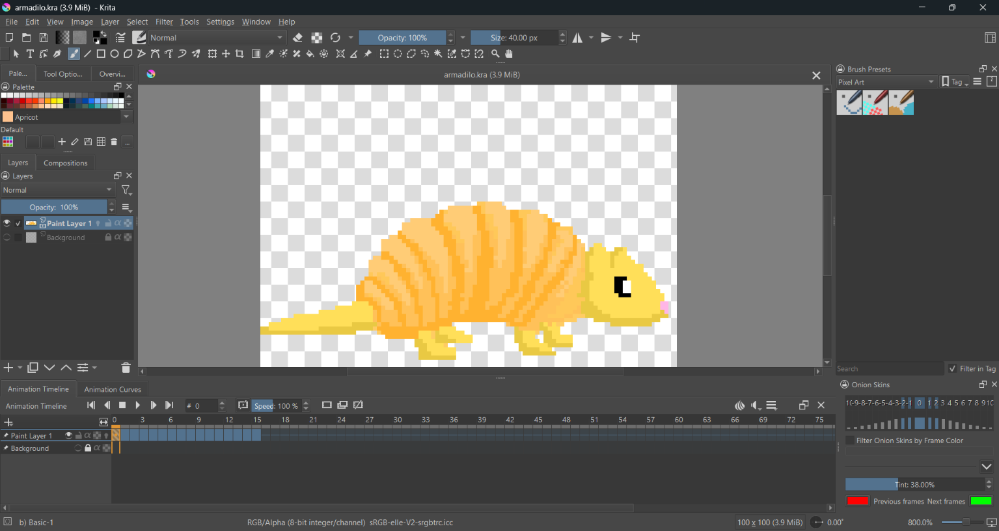
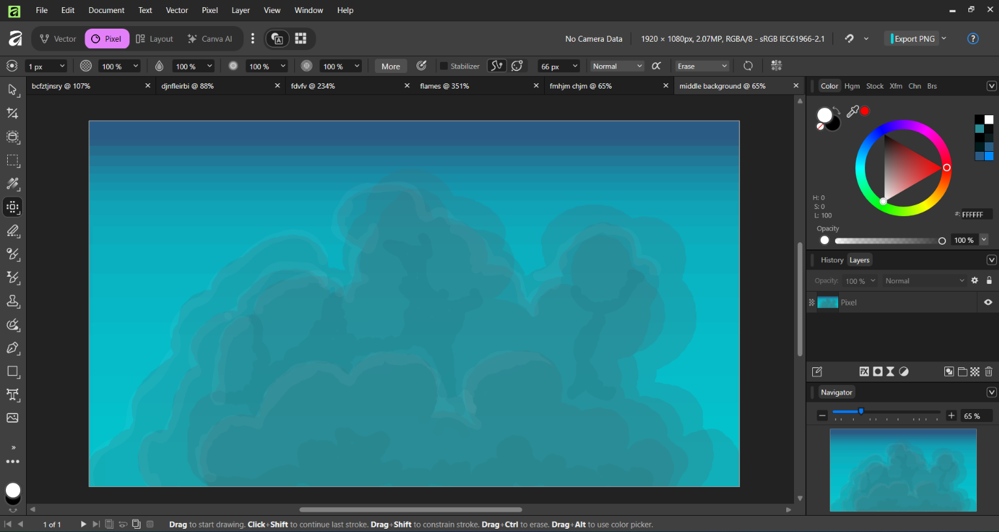
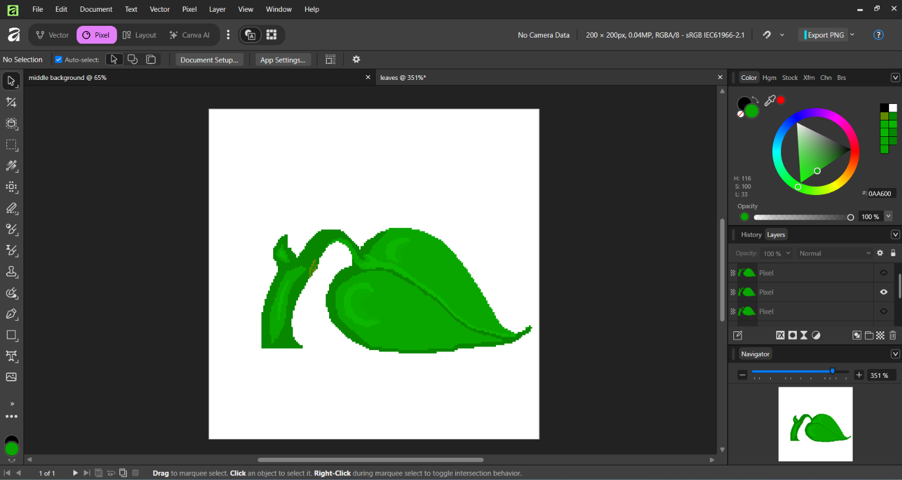
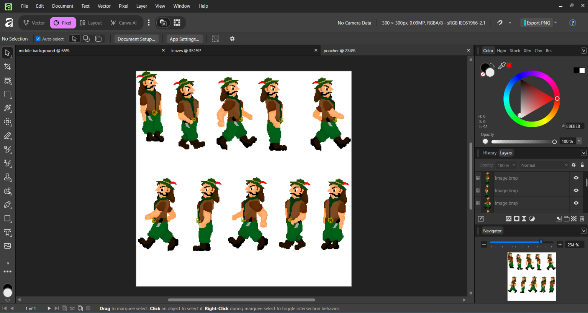
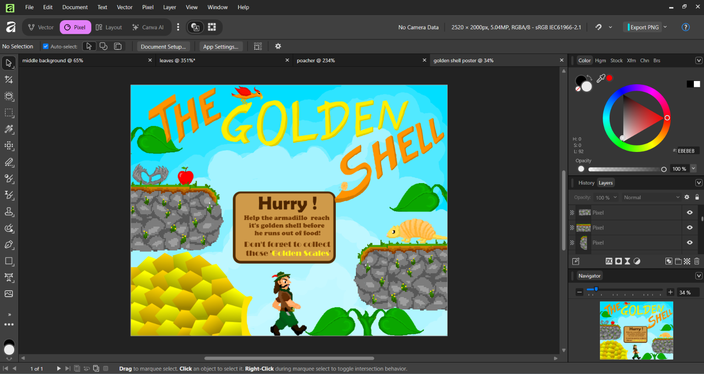

## Theme

Spinning

## Features
- Hand-drawn pixel art
- Side-view gameplay
- Obstacle avoidance
- Game jam project

## My Contribution
Everything in this project was created by me, including:
- Programming
- Game Design
- Pixel Art
- Animation
- Level Design

Every sprite in the game was hand-drawn.

## Tools Used
- Unity
- C#
- Affinity Designer
- Krita
- GitHub

## What I Learned
- Working under time constraints
- Scoping a project
- Building a complete playable game
- Pixel art production workflow
- Game jam development process

## Play The Game

 https://mrheck.itch.io/the-golden-shell
